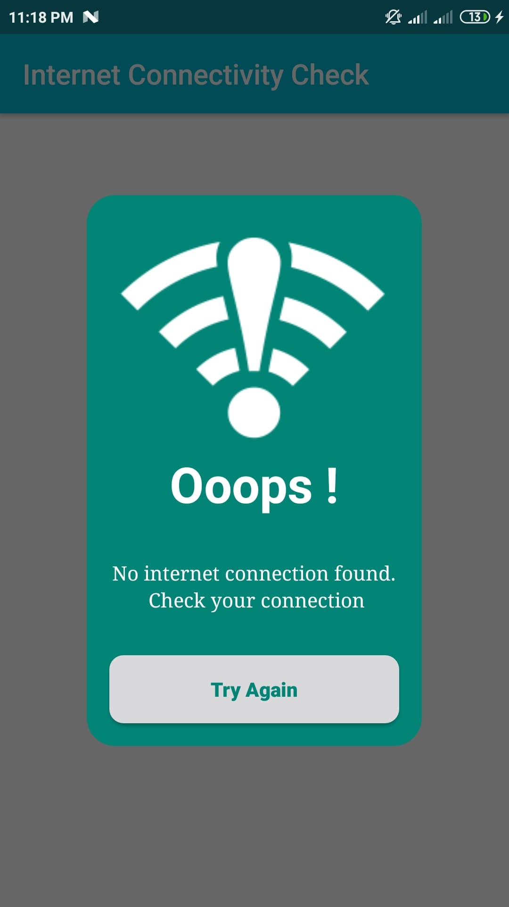
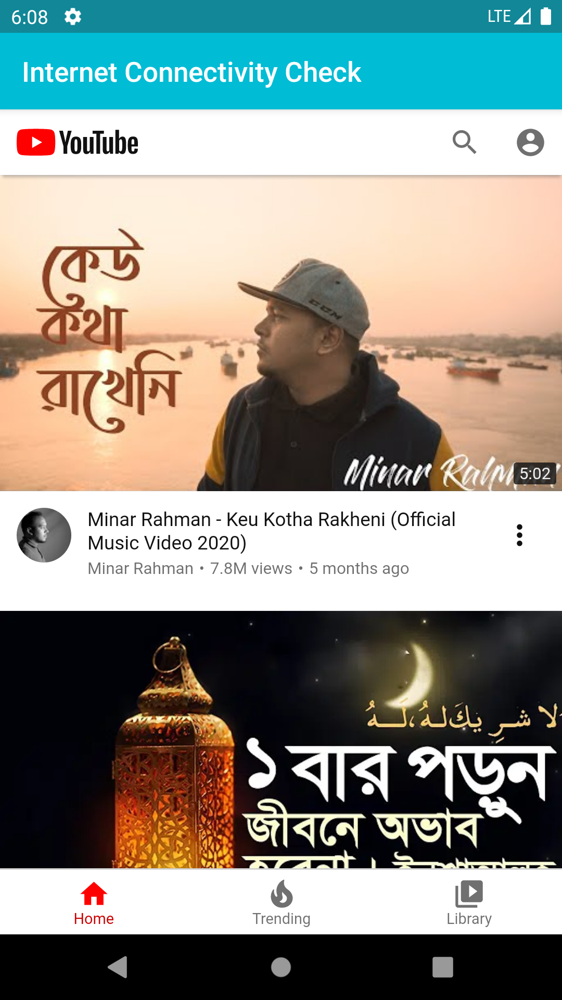

# Internet Connectivity Check

This project is for learning internet connectivity check feature in Android App Development.

### Feature : Internet Connectivity Check

### Permissions : 
  - ACCESS_NETWORK_STATE
  - INTERNET
 
## Screenshots
 &nbsp;&nbsp;&nbsp;&nbsp;&nbsp;&nbsp;&nbsp;&nbsp;&nbsp;&nbsp; 
